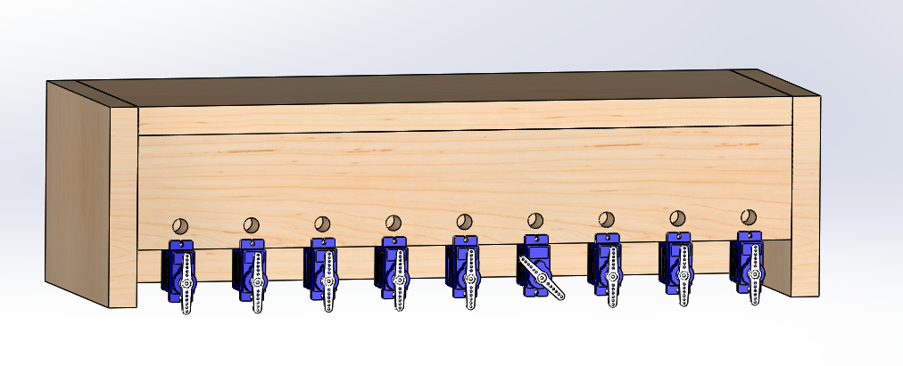

# Wireless Robotic Piano (9-DOF Tele-operation System) 🎹🤖

**An automatic control systems project featuring a compact actuator system capable of playing 18 piano keys using only 9 motors.**

## 📂 Project Resources
* **[View Project Slides & Circuit Diagram (PDF)](./Wireless%20Robotic%20Piano.pdf)** *(Note: Click to view architecture)*
* **[View Source Code](./Piano_Code.ino)**
* ## ⚙️ Mechanical Design (SolidWorks)
**[📂 View CAD Files & 3D Models](./Mechanical_Design)**

We utilized **SolidWorks** to design a custom chassis that integrates the servo motors and electronics into a compact form factor.

* **Design Intent:** Minimized footprint to fit 9 motors within the span of 18 standard piano keys.
* **Mounting Strategy:** Designed custom brackets for the SG90 servos to ensure rigid mounting, preventing mechanical "play" (wobble) during high-speed actuation.
* **Simulation:** Validated the servo horn travel paths in CAD to ensure the 55° (CW) and 60° (CCW) angles would perfectly strike the key centers without collision.

---

## 🔧 Technical Breakdown

### 1. Kinematics & Actuation
* **Optimization:** Solved hardware constraints by designing a **Bi-directional Actuation** mechanism. Each Servo controls two distinct outputs (CW → Key A, CCW → Key B), effectively doubling the system's mechanical resolution.
* **Hardware:** 9x SG90 Micro Servos with custom direct-drive horns.

### 2. Power Integrity & Safety
* **Problem:** Non-linear current demand (up to 4A peak) caused brownouts.
* **Solution:** Integrated an **XL4015 DC-DC Buck Converter** to step down 12V Li-Ion sources to a regulated 6V/5A rail. This isolated the high-current motor load from the microcontroller's logic.

### 3. Embedded Software & Architecture
* **Controller:** Arduino Uno.
* **Communication:** HC-05 Bluetooth Module (UART) using `SoftwareSerial`.
* **Latency:** Tuned signal timing (120ms actuation window) to ensure responsive playback.

---

## 🎮 Manual Control Map (ASCII Interface)

We implemented a real-time ASCII-to-Angle interface for wireless tele-operation.

| Letter | Note | Servo ID | Direction |
| :---: | :--- | :---: | :--- |
| **a** | Do | 0 | Left |
| **b** | Re | 1 | Left |
| **c** | Mi | 0 | Right |
| **d** | Fa | 1 | Right |
| **e** | Sol | 2 | Left |
| **f** | La | 3 | Left |
| **g** | Si | 2 | Right |
| **h** | High Do | 3 | Right |
| **i** | High Re | 4 | Left |
| **j** | High Mi | 5 | Left |
| **k** | High Fa | 4 | Right |
| **l** | High Sol | 5 | Right |
| **m** | High La | 6 | Left |
| **n** | High Si | 7 | Left |
| **o** | High Do+ | 6 | Right |
| **p** | High Re+ | 7 | Right |
| **q** | High Mi+ | 8 | Left |
| **r** | High Fa+ | 8 | Right |

### Automatic Presets
* **`1`** : Happy Birthday 🎂
* **`2`** : Merry Christmas 🎄
* **`3`** : Twinkle Twinkle 🌟
* **`4`** : Jingle Bells 🔔
* **`5`** : Ode to Joy (Dual Octave) 🎻
